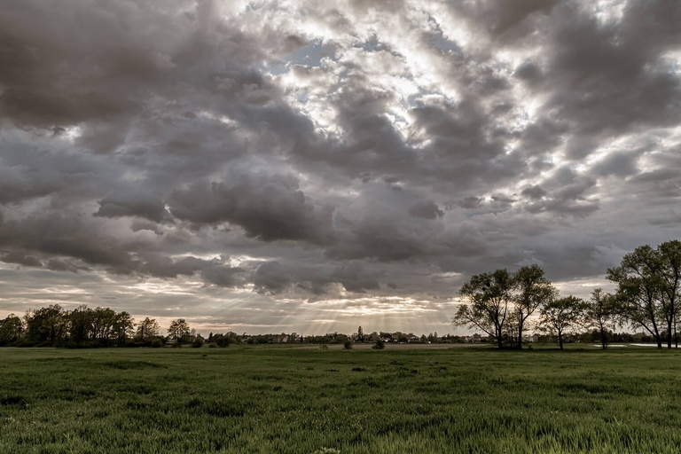

### Technologies: 

`jupyter, Pandas, cv2, numpy, matplotlib, streamlit, Roboflow, Google Drive, MS Office, DagsHub`

.............................................................................

### Personal Projects

### Project Title : [Predicting the ambient electrical energy output (PE) of a Combined Cycle Power Plant (CCCP) using Machine Learning algorithms](https://github.com/Madaar49/Data-Science-1.TU_Darmstadt_final_project)

<figure>
  
  <figcaption>Image source: unsplash.com/@jeisblack</figcaption>
</figure>

**Project affilation**
This is a final project done in fulfillment of the Data Science 1 course at the faculty of Electrical and Electronics at Technische Universitaet Darmstadt.

**Background**

This project aims to predict the ambient `electrical energy output (PE)` of a `Combined Cycle Power Plant (CCCP)`
By understanding how different conditions affect energy output, operators can adjust settings and configurations to maintain peak efficiency and help in scheduling maintenance and repairs, and avoid potential disasters from overloading. Towards society, effeciciency of the power plant, ensurs that consistent power is being provided. The Dataset was extracted at [UCI.edu](https://archive.ics.uci.edu/ml/datasets/combined+cycle+power+plant). Features are explained at the next section of the notebook
    
**Technologies**

  

 `Pandas, matplotlib, jupyter` 

**Deliverables**

The full project workflow and repository can be found [here](https://github.com/Madaar49/Data-Science-1.TU_Darmstadt_final_project/blob/main/Gbondo_2331706_Final_project.ipynb)

&nbsp; 

&nbsp;

## Project Title : [Predicting the ambient electrical energy output (PE) of a Combined Cycle Power Plant (CCCP) using Machine Learning algorithms](https://github.com/Madaar49/Data-Science-1.TU_Darmstadt_final_project)

<figure>
  
  <figcaption>Image source: unsplash.com/@jeisblack</figcaption>
</figure>

## Project affilation
This is a final project done in fulfillment of the Data Science 1 course at the faculty of Electrical and Electronics at Technische Universitaet Darmstadt.

## Background

**Objective :** To predict the ambient `electrical energy output (PE)` of a `Combined Cycle Power Plant (CCCP)`

**Societal and Economic benefits:**  Predicting the ambient `electrical energy output (PE)` of a CCCP is essential in measuring the effeciciency of the power plant, in providing energy for the community.
    
**The Dataset:** Will be extracted at [UCI.edu](https://archive.ics.uci.edu/ml/datasets/combined+cycle+power+plant). Features are explained at the next section of the notebook
    
**Problem statement:** The ambient `electrical energy output (PE)` of a CCCP is essential in regulating a power plant working at full load. This is required to preventing disasters and energy savings."

## Technologies

  

`Pandas, matplotlib, jupyter`

## Deliverables

The full project workflow and repository can be found [here](https://github.com/Madaar49/Data-Science-1.TU_Darmstadt_final_project/blob/main/Gbondo_2331706_Final_project.ipynb)

&nbsp; 

&nbsp;

............................................................................. 

# OMDENA collaboration projects

## Project I was involved in as a **Junior Machine Learning Engineer** at Omdena
&nbsp; 

## Project Title : [Forecasting industrial CO2 using machine learning](https://github.com/OmdenaAI/saudi-arabia-industrial-co2/)

<figure>
  
  <figcaption>Image source: OMDENA.com</figcaption>
</figure>

#### -- Project Status: Completed

## Background

Industrial carbon emissions have become a significant environmental issue due to the large contribution of industrial processes to global emissions. The combustion of fossil fuels for energy generation, transportation, and manufacturing has resulted in several climate change and global warming issue. Therefore reducing industrial carbon emissions has become a critical challenge. This project leverages machine learning (ML) techniques to predict and evaluate carbon emissions in various industries. 

### Collaborators
* You can find all the collaborators in the project [repository](https://github.com/OmdenaAI/saudi-arabia-industrial-co2)

## Technologies

  

### `jupyter, Pandas, numpy, matplotlib, streamlit`

### Tasks 
**Task-- Data** [Data sources](https://github.com/OmdenaAI/saudi-arabia-industrial-co2/tree/main/src/tasks/task1-data) were sought to find a suitable data for the project. The best data for our project was the OWID dataset. Data exploration was done and can be found.

**Task-- Experimental Models** Experimental models were designed to test for a suitable model for the project. The noteooks for the experimental models can be found [here](https://github.com/OmdenaAI/saudi-arabia-industrial-co2/tree/main/src/tasks/task2-exp-models-team-2) in this repo.
What specific data analysis/visualization 

**Task-- Model development** using LSTM and Arima on the OWID dataset
modelling work are you using to solve the problem?

**Task-- model deployment** using Streamlit. The deployed model can be found [here](https://github.com/OmdenaAI/saudi-arabia-industrial-co2/tree/main/src/tasks/task-3-deployment-presentation) in this repo.

**My Contribution:** 

`Data group.`: 
- research on suitable data to be used in the project. 
 
 - Used domain knowledge in Environmental Science in processing and analyzing the data.

`Modelling group`
 - Created a “Neural Prophet” forecasting model with an MAPE accuracy of 0.01

>\[!TIP\]
>[**The deployed app can be accessed here**](https://saudi-arabia-industrial-co2.streamlit.app/)

&nbsp; 

&nbsp;

## Project Title : [Advanced weather forecasting with machine learning and python](https://github.com/OmdenaAI/karachi-pakistan-weather-prediction)

<figure>
  
  <figcaption>Image source: OMDENA.com</figcaption>
</figure>

#### -- Project Status: Completed

## Background

Between 1992 and 2021, climate- and weather-related disasters in Pakistan resulted in a total of US$29.3 billion of economic losses (inflation-adjusted to 2021 US dollars) from damage to property, crops, and livestock, equivalent to 11.1% of 2020 GDP.Over the same period, these disasters also caused the deaths of an estimated 20,000 people, and an estimated 10 million people have been displaced by weather-related disasters in Pakistan since 1992.

Accurate weather forecasts could help reduce these losses by providing early warning of hazardous weather conditions, allowing people to protect themselves and their property.

The goal of this project is to develop a machine learning model that can improve the accuracy of weather forecasts for Pakistan. The model will be trained on a dataset of historical weather data, and it will be able to predict future weather conditions with greater accuracy than current models.

## Collaborators
* You can find all the collaborators in this [repository](https://github.com/OmdenaAI/karachi-pakistan-weather-prediction)

## Technologies

  

### `jupyter, Pandas, numpy, matplotlib, streamlit`

## Tasks 
**Task-- Data collection** We collected the data from [Open Meteo](https://open-meteo.com/en/docs/historical-weather-api) using requests and pandas library. The repo of the data collection can be found in this [subfolder](https://github.com/OmdenaAI/karachi-pakistan-weather-prediction/tree/main/src/tasks/task1-collection). Full descrition of the parameters used in the model can be found in the `README.md` file.

**Task-- Exploratory Data Analysis (EDA)**
EDA was done using descriptive and inferential statistics. `Matplotlib` and `Seaborn` libraries were primarily used for visualization. The notebooks for the EDA can be found [here](https://github.com/OmdenaAI/karachi-pakistan-weather-prediction/tree/main/src/tasks/task-2-EDA) in this repo.
What specific data analysis/visualization 

**Task-- Model development :** models such as `LSTM`, `Random Forest` and `ARIMAX` were developed to forecast the different meterological parameters. Models of 30 days forecasts were done on the different meterological parameters. `Random Forest` was the best model with an `accuracy up to 92%`. The notebooks can be found [here](https://github.com/OmdenaAI/saudi-arabia-industrial-co2/tree/main/src/tasks/task2-exp-models-team-2) in this repo.

**Task-- model deployment :** The deployment script can be found [here](https://github.com/OmdenaAI/karachi-pakistan-weather-prediction/blob/main/src/tasks/task_3_modelling/Modelling_RandomForest.ipynb) in this repo.

## **My Contribution:** 

`Task-- Model development`: Developed a 30 days forecast model of precipitation using LSTM.

`Task-- model deployment`: Developed a streamlit app to host the models

>\[!TIP\]
>[**The deployed app can be accessed here**](https://karachi-pakistan-weather-prediction.streamlit.app/)

## **Challenges Faced**
 - Data accessibility
 - Not all models were deployed due to model compartibility with streamlit app

&nbsp; 

&nbsp;

## Project Title : [Detecting microorganisms in water with deep learning](https://dagshub.com/Omdena/SanJoseUSA_Microorganisms)

<figure>
  
  <figcaption>Image source: OMDENA.com</figcaption>
</figure>

#### -- Project Status: Completed

## Background

United States does a very good job of providing clean and safe drinking water to most of its residents, but water borne diseases are becoming an increasing problem. According to the Centers for Disease Control (CDC), approximately 7.5 million waterborne illness occur annually, with a healthcare cost of about $3.3 billion. These infections result in emergency visits, hospitalizations, and deaths. These are caused by microorganisms, viruses, and fecal matter in the drinking water that are the result of an aging infrastructure, chlorine resistant pathogens, and finally an increase in recreational water use.

## Collaborators
* You can find all the collaborators in the DagsHub [repository](https://dagshub.com/Omdena/SanJoseUSA_Microorganisms)

## Technologies

  

### `jupyter, Pandas, cv2, numpy, matplotlib, streamlit, Roboflow, Google Drive, MS Office, DagsHub`

## Task groups

**Task-- Data and research**  The data used for this project are [Environmental  Microorganism Image  Dataset Sixth Version (EMDS-6) and Environmental Microorganism Image Dataset Seventh Version (EMDS-7)](https://www.frontiersin.org/journals/microbiology/articles/10.3389/fmicb.2023.1084312/full)
The data repo can be found [here](https://dagshub.com/Omdena/SanJoseUSA_Microorganisms/src/task-1-research-bacteria-and-datasets) 
Attached  with  the  EMDS-7dataset  is  an  object  labelling  file in  .XML  format. This file was not available for the EMDS-6 dataset, so it was created using the ‘Roboflow’software. A Microsoft Excel sheet was created as an input file to record the Microorganisms and their respective classes.
This data was verified by an expert microbiologist.

**Task-- EDA** Exploratory Data Analysis
were done using the cv2 module for image data, and pandas. Class (type of microorganism) and image dimension were checked for consistency. `Matplotlib` and `Seaborn` libraries were primarily used for visualization. The notebooks for the EDA can be found [here](https://dagshub.com/Omdena/SanJoseUSA_Microorganisms/src/task-2-exploratory-data-analysis/src/task-2-exploratory-data-analysis/notebooks/gmilam/EDA_EMDS7.ipynb) in this repo.

**Task-- Model development** Baseline models were developed using YOLOv8m-cls (for classification), SSD(single-shot detector), EfficientNet, Faster R-CNN, Detectron2 (image detection) were developed. 

**Task-- Model deployment** The models deployed are `YOLOv8m-cls` and `Detectron2`. Model deployment was done using Streamlit. 

**Task--Presentation** Presentation and documentation of the whole project thereby creating a starting point for the next phase (mobile app development)

## My Contribution

`Data and research`: Research for suitable dataset. 

`Task--Presentation`: Lead the documentation and presentation of the whole project.

The project blog can be found [here](https://www.omdena.com/blog/safeguard-public-health-through-environmental-microorganism-detection-in-water-using-deep-learning)

## Challenges Faced 
Difficulty to get adequate dataset for model training.

>\[!TIP\]
>[**The deployed app can be accessed here**](https://sanjoseusa-microorganism-detection.streamlit.app/)

&nbsp; 

&nbsp;

## Project Title : [Flood Guard: Integration of precipitation time series and GIS data for flood forecast in Bangladesh](https://dagshub.com/Omdena/BangladeshChapter_FloodGuard)

<figure>
  
  <figcaption>Image source: OMDENA.com</figcaption>
</figure>

#### -- Project Status: Completed

## Background

Bangladesh is highly susceptible to flooding due to its unique geography and monsoon climate. Flooding leads to significant socio-economic and environmental consequences, causing the loss of lives, displacing communities, damaging infrastructure, and disrupting livelihoods. According to historical data from the Bangladesh Water Development Board (BWDB) and the Department of Disaster Management, flooding occurs annually during the monsoon season, affecting millions of people and causing substantial economic losses.

The goal of this project is to leverage time series rainfall data and Geographic Information System (GIS) data to develop a predictive model that can forecast flood occurrences and waterbody behavior across Bangladesh

## Collaborators
* You can find all the collaborators in the  DagsHub [repository](https://dagshub.com/Omdena/BangladeshChapter_FloodGuard/)

## Technologies

  

### `jupyter, Pandas, numpy, matplotlib, streamlit, Google Drive, MS Office, DagsHub`

## Task groups

**Task-- Knowledge :** Research of articles for data models and techniques.

**Task-- Data and research :**  GIS and csv data were extracted using Google Earth Engine.

The extracted data and scripts used for this project are found [here](https://dagshub.com/Omdena/BangladeshChapter_FloodGuard/src/main/src/tasks/task-1-data-collection-and%20processing)

**Task-- EDA :** Exploratory Data Analysis
were done using the `numpy` library. `Matplotlib` and `Seaborn` libraries were primarily used for visualization. The notebooks for the EDA can be found [here](https://dagshub.com/Omdena/BangladeshChapter_FloodGuard/src/main/src/tasks/task-2-exploratory-data-analysis/ShinYing/EDA_Flood_Consequences.ipynb) in this repo.

**Task-- Model development :** Baseline models were developed such as Sequential, Conv1D, LSTM, RNN, LSTM. Layers and parameters were modified to increase the accuracy of the models.
The developed models can be found [here](https://dagshub.com/Omdena/BangladeshChapter_FloodGuard/src/main/src/tasks/task-3-fe-and-model-development) in this repo.

**Task-- Model deployment :** The model deployed was `LSTM` using Streamlit app. The deployed model can be found [here](https://dagshub.com/Omdena/BangladeshChapter_FloodGuard/src/main/src/tasks/task-4-model-deployment) in this repo.

## My Contribution

`Task-- Data and research`: Research on articles to identify suitable data, models and their performances for the project

>\[!TIP\]
>[**The deployed app can be accessed here**](https://app-bl-flood.streamlit.app/)

