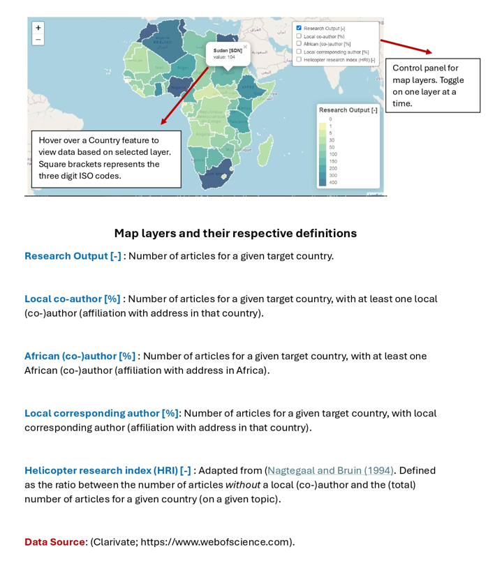

## Project Title : Land Use Land cover classification of Ar-Raqqa, Syria.

#### -- Project Status: Completed

## Overview

This project was built on the [Frei-Universitaet Berlin GEO-IT coursework](https://www.geo.fu-berlin.de/en/v/geo-it/gee/3-classification/3-2-classification-gee/index.html). It aimed at utilizing geospatial technologies for environmental monitoring and assessment. Remote sensing data and machine learning algorithms within Google Earth Engine were used to classify land cover in Ar-Raqqa, Syria. Land surface temperature (LST) layer was also overlaid on the map, to visualize the spatial variability of Temperature.

## Method

The Area of Interest (AOI) was classified into four land use classes (Water, Vegetation, Urban and barren). Training classes of the four land use classes were created using point geometry. Two models (CART model and Random Forest Model) were compared interms of accuracy socre. Final results of the classification showed that the Random Forest model had a 90% accuracy, while the CART model with a 86% accuracy.

*Land use land cover mapping of Raqqa using CART and Random Forest supervised classification techniques*

[The Google Earth Engiene code can be found here](https://code.earthengine.google.com/bef2edae1acc57fa74b8fe72e0083e27) 

**Comments/Future works**
- How does the accuracy of the classification changes within platforms and amongst platforms?
- Is there a relationship between the LULC and Temperature change over time?

&nbsp; 

&nbsp;

## Project Title : [An interactive visualization of the maps used in my research paper](https://github.com/Madaar49/Authorship-patterns-groundwater-africa)

### [Link to research paper](https://www.sciencedirect.com/science/article/pii/S0012825224001867)

## Tools
leaflet

## Overview
This project was done to ensure better visualizations of the maps in my publication. In the publication, the map uses the three digit ISO country codes, which can be difficult for readers without geographical knowledge to easily decipher. Therefore, with this interactive 

## Summary of method

**Data Transformation :** The data was in the form of a shapefile, and this was transformed to geojson file (compartible for web maping services) using `python programming`. 

**Webmap development :** To develop the web map, `html`, leaflet `Javascript` and `css` were used. The aim was to depoly all relevant layers on the map with a responsive popup, and each with their own legend. This was made possible by creating functions in leaflet `Javascript` and conditional statements passed on based on layer. More information can be found in the [github repository](https://github.com/Madaar49/Authorship-patterns-groundwater-africa)

## Map
Details of the map layers and the interface can be accessed below.

### Layer description

<figure>
  
  <figcaption></figcaption>
</figure>

### webmap Interface

<iframe src="https://madaar49.github.io/Authorship-patterns-groundwater-africa/
" height="500" width="1000"></iframe>

&nbsp; 

&nbsp;

# Project 3
### Title : Development of a relational database management system for all the spatial  and non-spatial data of my personal projects.

## Tools : 
`PostgreSQL/PostGIS`, `ESRI Database`, `SQL-Alchemy`, `TimescaleDB`,  

