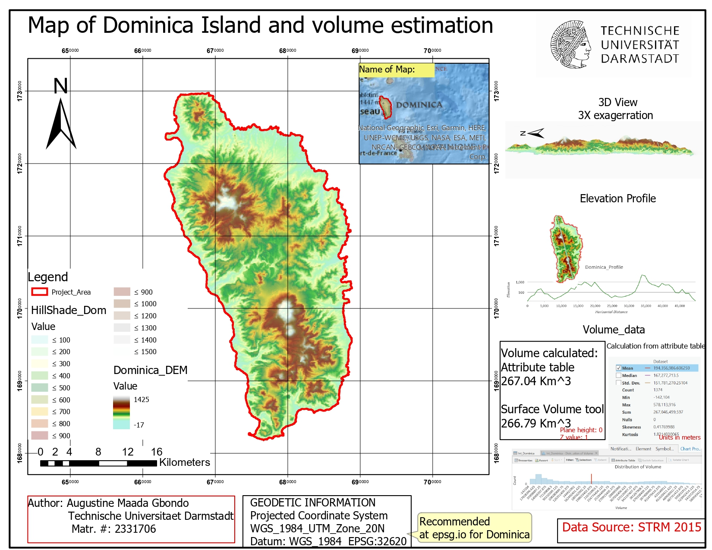
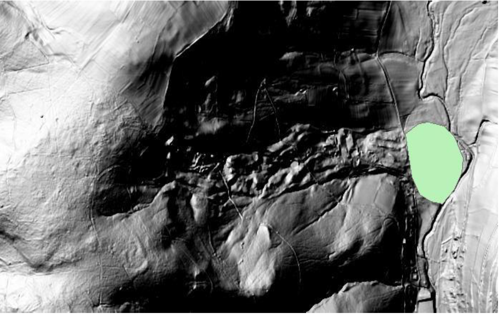
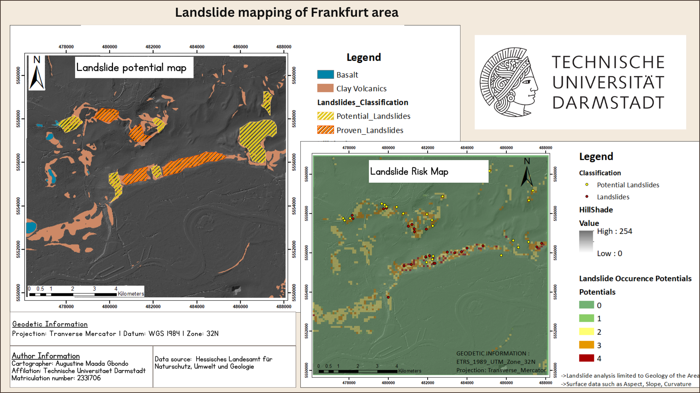
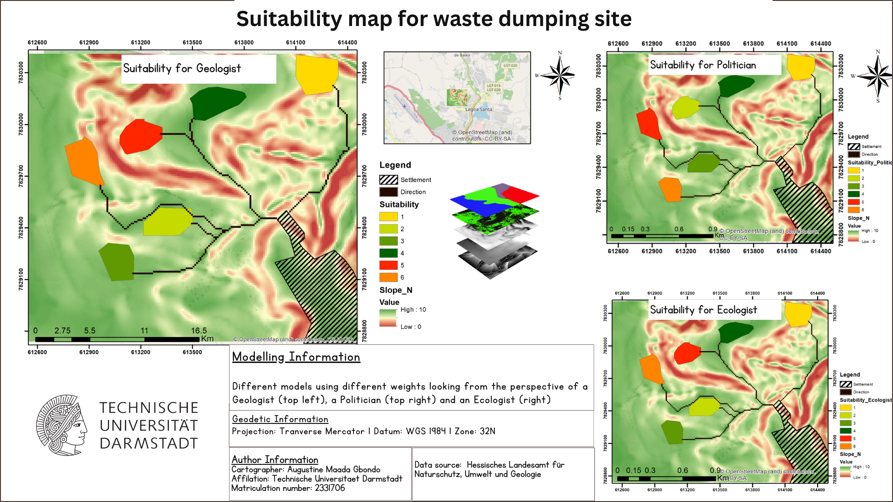

## Project Theme: Digitizing 
### Project Title : Digitizing the Geology map of Dominica

## Overview

This project aims to digitize the Map of Dominica. Map digitizing is the process of  converting physical maps and other cartographic information into a digital format. Digitize map formats improves data accessibility, fosters enhance and efficient analysis, and acn be integration with other geospatial datasets.

## Method

**Data:** The data used for this exercise was a picture format of the Dominica Map, and was provided by the Geoinformation Science Group at Technische Universiatet Darmstadt. Original source of the data is referenced in the final map.

<figure>
  
  <figcaption>Geology map of Dominica</figcaption>
</figure>

### 1. Digitizing the Geology map of Dominica**

### Tools

**ArcMap** Data management, geoprocessing
  - ESRI Geodatabase
  - Toolboxes: 
    - Georeferencing toolbar 
    - Edit toolbar 
      - Create features 
      - Manage edits : Map Topology, Inspect errors

### Workflow

A new ArcMap roject was setup and a Geographic Coordinate System (GCS) was  defined for the map environment.The Dominica map in an image file format was imported. The map was then georeferenced using known control points (know areas that can be located on the map), followed by the creation of a file geodatabase to store feature classes for geology and tectonics as distinct layers.

The *Editor toolbar* in ArcMap was used to digitize the map. Two main digizing methods were used, the Geological units were digitized as `Polygon features`, and the Tectonics were digitized as `line features`. 

The map was then  analyzed using the *Topology* tool in the Edit toolbar for quality control. Finally, a layout was be designed, the digitized map stored in the ESRI geodatabase, and png format exported for printing.

### Deliverables
 Fig. n The completed digitized Geology map of Dominica

### **2. Calculation of the volume of Dominica**

### Tools

**ArcMap** Data management, geoprocessing, spatial analysis
  - ESRI Geodatabase
  - Toolboxes: 
    - Analysis toolbox
      - Extract toolset
    - 3D Analyst toolbox
      - Functional Surface toolset

### workflow

A DEM of Dominica was used to calculate the volume. The DEM raster was downloaded from opendem.org and cliped (using the *clip* tool in the `Extract toolset`) to the Dominica Area of interest (AOI). The *Surface Volume* tool in the `Functional Surface toolset`was used to calculate the volume. The input data was the clipped Dominica DEM and the reference plane was specified as above sea level. An output table was calculated to store the volume results. The map was then exported into a layout and other information added.

### Deliverables

&nbsp; 

&nbsp;

## Project Theme: Mudflow 
### Project Title : Assessing the volume of a landslide using remotely sensed data

## Overview

This project intended to investigate a site with a history of landslides, where proposed dam is planned. Understanding how much material have been moved is crucial in estimating the severity of the landslides, as well as the feasibility of the area for the project.

## Data and Method

**Data:** The data used for this exercise were DEM data, Area of interest (AOI) - basis of the mudflow, and SRTM data. The first two data was provided by the Geoinformation Science Group at Technische Universitaet Darmstadt, and the SRTM was downloaded at [Earth Explorer](earthexplorer.usgs.gov)

## Tools

**ArcMap :** Data management, geoprocessing, spatial analysis, modelling
    - ESRI Geodatabase
    -  Toolboxes
      - Edit toolbar
      - Spatial Analyst toolbox
        - surface toolset
        - Interpolation toolset
        - Data Management toolbox
          - Sampling toolset
            - create fishnet
      - Georeferencing tools, Editing toolbox, Data Management    
       toolbox (Topology toolset)

**ArcScene :** 3D visualization

### Workflow

To analyze the potential impact of a planned dam in a landslide-prone area, the first step includes creating a new ArcGIS project and add the relevant dataset. A suitable hillshade was created (using the *hillshade* tool in the `surface toolset`) using the provided DEM data and was clipped to the area of interest (AOI) which represents the Mudflow. To create a second raster surface that represents the relocated material, points were digitized (using the *Edit toolbar*) around the AOI. This data was then interpolated (using *Spline* and *IDW* tools in the `Interpolation toolset`) for comparison. The volume of the material was calculated by creating a 1x1m fishnet (using the *create fishnet* tool in the `Sampling toolset`) and assigned values to the attribute table. This process can also be done using  the Math Toolbox or Raster Calculator. The results were verified by repeating the workflow with an SRTM data, to compare the two calculated volumes.

## Deliverables

&nbsp; 

&nbsp;

## Project Theme: Landslide analysis
### Project Title : Assessing mass movement potentials around Frankfurt on the basis of given parameters

## Overview

This project intended to model the potential of landslides around Frankfurt area. By modeling potential landslides, potential disasters can be avoides and reduce or eliminate loss of life and damage to properties. GIS methods of landslide hazard assessment are usually done on the basis of given parameters. These parameters include DEM (slope and relief), Geology, Soil, Hydrology, Geomorphology, Landuse etc.

## Data and method

**Data:** The data used for this exercise were a DEM map (opendem.org), historical landslide map, Suceptible units for landslide and Area of Interest (AOI) polygon, all which were provided by the Geoinformation group at Technische Universitaet Darmstadt.

## Tools

**ArcMap** Data management, geoprocessing, spatial analysis, modelling
    - ESRI Geodatabase
    - Toolboxes: 
      - Spatial analyst toolbox
        - Surface toolset
        - Extraction toolset
      - Data Management toolbox
        - Sampling toolset
          - create fishnet
      - Analysis toolbox
        - Overlay toolset

&nbsp;

## Methodology 

A new ArcGIS project was created along with a file geodatabase, this was followed by defining a coordinate reference system to the working environment. 

By using the `surface toolset` in the Spatial analysis toolbox, surface information such as slope, aspect, and curvature from the DEM were created, and this data was added to the Landslide feature class using the *extract multi values to points* tool in the `Extraction toolset`. The geological data (vector format) was reclassified (using the field calculator in the attribute table) into two classes based on potential for landslide and this was also added to the Landslide data using the *spatial join* tool in the `Overlay toolset`. 

To focus on areas being investigated for potential landslides, a fishnet was created (using the *create fishnet* tool in the `Sampling toolset`) to join and limit surface information to susceptible units. 

Additionally, a second potential map using hillshade at different angles was developed, and the areas with potentials were digitize.

## Deliverables

&nbsp; 

&nbsp;

## Project Theme: Spatial Analyst
### Title : Choosing a suitable location for a waste disposal site

## Overview

This project intended to choose a suitable site for a waste disposal by taking into account several environmental, financial and social factors. Five areas were proposed for a waste deposit site, and this task aimed at choosing the best site.

## Data and method

**Data:** 

The data used for this exercise were the settlement area, Potential sites for waste disposal, a DEM, digitized geological map, and a georeferenced Google Earth image. These were provided by the Geoinformation Science Group at Technische Universitaet Darmstadt.

*Fig. Georeferenced google earth image of the study area*

## Tools

**ArcMap** Data management, geoprocessing, spatial analysis, modelling
  - Toolboxes: 
    - Conversion Tools 
      - To Raster 
    - Spatial Analyst toolbox
      - Reclassify
      - Multivariate
        - Iso Cluster
        - Maximum Likelyhood Classification
      - Map Algebra toolset
        - Raster calculator
      - Zonal toolset

## Methodology

Several criteria are predefined in selecting a suitable area. A flat area and suitable geology, should be environmentally (do not affect the biodiversity), it should be far from river or creek to avoid contamination of the water bodies, and good connection to the settlement. 

To start, a new project was setup with ArcMap. The data provided was imported, and vector files were rasterized, and later standardized using suitable calculations. The topography was determined by calculating a standardized form of the slope, the geology map was rasterized (using the *Polygon to Raster* tool in the `To Raster` toolset ) and reclassified (using the *Reclassify* tool in the `Reclass Toolset`) into two classes. the Google Earth image was also classified into two categories to distinguish the forest areas (Greenery)  from other areas. This was done using the *Iso Cluster* tool to create a signature file and *Maximum Likelyhood Classification* tool for classification. Proxies and indicators of river and streams were also determined and used as input parameters. 

After the initial data processing, the suitability map was calculated using the *Raster calculator* tool in the `Map Algebra toolset` toolset. This tool uses a weighted input of the relevant parameters to model a suitable site for waste disposal. *Zonal statistics tool* in the `zonal toolset` were then applied to rank the suitability of the different sites based on the model results.

Two additional maps were created by changing the weights to get the perspective of an Ecologist (gives high priority to Ecology and Biodiversity) and Politician (priority to reduce cost i.e distance to site)

## Deliverables

*Fig n. The image below shows three maps modelled using different weights of the input parameters the suitability was ranked 1 to 6 with 1 - representing a suitable site and 6 - representing a less suitable site*

**Comments**

&nbsp; 

&nbsp;

## Project Theme: Groundwater Mapping
### Project Title : A 3D WebScene including hydrological and geological information

## Overview

This project was designed to work with SKUA GOCAD S-GRID data in ArcGIS Pro, and add a 2D basemap as a 3D geological data to ArcScene. The second part of the exercise include groundwater contouring using groundwater heads data, which was also added to the webscene.  

## Method
Summary of the data used and method is described below

### Data

**SGrids:** also referred to as Structured grids, are a type of data structure popular in geosciences. It is used to represent spatial data - particulary structures that varies continously over space. these were provided by the Geoinformation Science Group at Technische Universitaet Darmstadt. 

<figure>
  
  <figcaption>sGrid of Darmstadt viewed in ArcScene</figcaption>
</figure>

**Groundwater level data:** Data of groundwater heads was retrieved from GruSchu (http://gruschu.hessen.de) -  the specialized information system for groundwater and drinking water protection for the federal state of Hesse. It is governed by the Hessian Agency for Nature Conservation, Environment and Geology (www.hlnug.de).

## Tools 

**ArcGIS Pro** Data management, geoprocessing, spatial analysis
  - GeologicToolbox - a custom developed toolbox *Schmidt et. al (2017)*
  - Spatial Analyst toolbox 
    - Interpolation toolset
      - IDW  (inverse distance weighting)
    - Surface toolset 
      - Contour

**ArcScene** 3D Visualization

**ArcGIS Online** Webmap pulishing online

**WebScene** 3D Visualization online

## Methodology 

The SKUA-GOCAD data was imported into ArcGIS Pro using a custom toolbox (*GeologicToolbox* by Schmidt et. al (2017)), and then published to ArcScene. 

Groundwater level data for two months, April and October were interpolated (using *IDW* method), and contours (using the *Countour tool* in the `surface toolset`) were created for each month. The created  contours and other layers were then published in ArcScene.

## Deliverables

### Groundwater contour map

<iframe width="500" height="400" frameborder="0" scrolling="no" marginheight="0" marginwidth="0" title="Gbondo_FH_GISII_2021" src="//tu-darmstadt.maps.arcgis.com/apps/Embed/index.html?webmap=f8a1c6c04c114872b3c091690f34079a&extent=8.3885,49.7825,9.0332,49.9816&zoom=true&previewImage=true&scale=true&legendlayers=true&disable_scroll=true&theme=light"></iframe>

&nbsp; 

## Comments/Future works

Does the type of interpolation method use affect the spatial model od groundwater heads in the project area?

  - Test different interpolation methods e.g Kriging, IDW, Spline etc.
  - Develop a semi-variogram for kriging method

