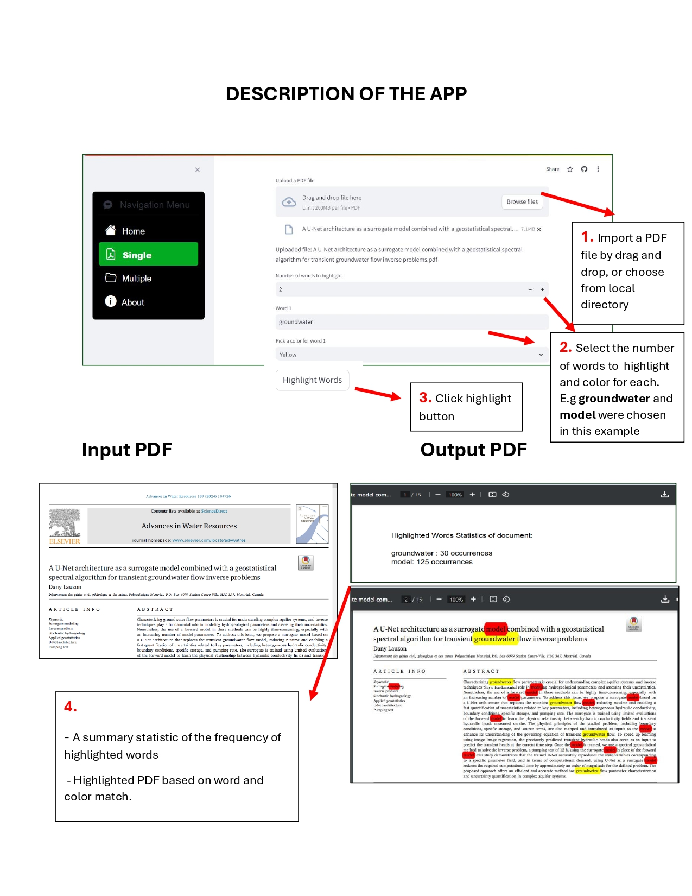

# Project Title : Automating the process of factsheet generation using python (**autofactsheet**)

## Overview

This task is part of the Hessian state radon strategy – which was a radon measurement campaign in Hessen to measure the radon concentration in soil and soil-gas. There are two main stakeholders in the project; the [Hessischen Landesamt für Naturschutz, Umwelt und Geologie (HLNUG)](https://www.hlnug.de/geologie/radon-in-hessen/geowissenschaftliche-begleitung-der-landesradonstrategie), and the Technische Hochschule Mittelhessen (THM) in Gießen at the [Hessischen Radonzentrum (HeRaZ)](https://www.thm.de/heraz/index.php). Creating factsheets is part of the public relation strategy of the project, for locals in Hessen to be aware of radon in the environment.

*A factsheet* – in context to this project is a piece of document that contains essential information about the radon measurement for a particular measuring point.

## Contributors

**Augustine Maada Gbondo** (Script development and database design),  **Tatjana Laupenmühlen** (Template design and database design), **Dr. Heiner Heggemann** (Quality control and supervision), **Dr. Rouwen Lehné** (Quality control and supervision)

**Project Status: First phase completed**

***Technologies used :*** *python, vscode, jupyter, Google Drive, Microsoft Office*

**Deliverables**

<em>Screenshot of the factsheet production pipeline</em>

>\[!TIP\]
>**The processing speed of this app is 2 seconds per PDF generation and can process thousands of PDF files**

**Comment**
This project includes sensitive data, and the code is property of HLNUG. Therefore detailed information cannot be disclosed until further notice. 

&nbsp; 

&nbsp;

## Project Title : hlnug-word-highlighter-app

## Overview

This project was done for [Hessischen Landesamt für Naturschutz, Umwelt und Geologie (HLNUG)](https://www.hlnug.de/geologie), to increase productivity during research and literature review of documents by staffs. 

Staff at the agency work with documents for literature review, among other tasks. The relevance of the document mostly depends on the frequency of keywords.

This app will therefore help in identifying relevant documents so that literature reviews can be done at a much faster rate.

**Project Status: Completed**

**Key technologies used :** *python, vscode, git, github, streamlit*

**Deliverables**

<em>Above is a short description on how the app works</em>

**Comment**
This project is now property of HLNUG, therefore link to the webapp cannot be disclosed until further notice. 

>\[!TIP\]
>**The processing speed of this app is 0.3 seconds**

&nbsp; 

&nbsp;

# Project Title : DEM downloader app

## Overview

Digital Elevation Models (DEM) are normally downloaded from several provided - the most common is the [Earth Explorer](https://earthexplorer.usgs.gov). One challenge faced with acquiring this data is that, the data is in the form of tiles and if a project area falls on different tiles, then a user must download all the tiles and perform some preprocessing functions (Clip and fill).

The project aimed at creating a DEM Downloader app, to automate this process of downloading and clipping the DEM data, to a users exact region of interest.

**Project Status: Ongoing**
