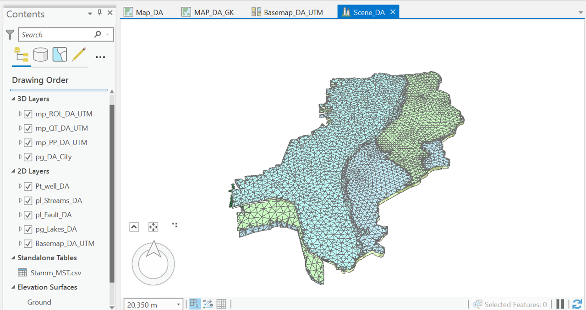

<figure>
  
  <figcaption>sGrid of Darmstadt in ArcScene</figcaption>
</figure>

## ArcGIS Product/app: ArcGIS Survey123
### Title : Water Point survey for rehabilitation project in Kono District, Sierra Leone
#### Tools used

## Overview

This survey sheet was developed to learn the functionality of the ArcGIS Survey123 app. The survey sheet was a conceptual project for a rural water point rehabilitation project in Kono District. The aim is to gather participants information about the location and functionality of water points, which will serve as a first step for the Government to understand the status of water points in the district.

The survey form can be accessed at : https://survey123.arcgis.com/share/93d85fcf505744e9bd100ee8170b71f1

*You can also scan the QR code with your phone.*

#### App: ArcGIS Online

Below is the link to the Webmap showing the results of the survey.

[Link to the webmap](https://survey123.arcgis.com/share/93d85fcf505744e9bd100ee8170b71f1)

 
## ArcGIS Product/app: ArcGIS Dashboards
### Title : Sierra Leone water points Dashboard 

## Overview 

This dashboard was created using the WASH Baseline study (2016) in Sierra Leone. This survey was done regarding access to water supply and sanitation for households and institutions in Sierra Leone as the starting point for the internationally agreed Sustainable Development Goals (SDGs). The data was accessed at https://washdata-sl.org/wash-data/ and processed in python focusing on the water point only. The repository can be accessed at ""

*Tools*
`python programming`, `ArcGIS Dashboard`, `ArcGIS Online`

<body>
    <iframe src="https://africageoportal.maps.arcgis.com/apps/dashboards/912c78bb3e644e31a9976f847a4fd51a#mode=edit"></iframe>
</body>